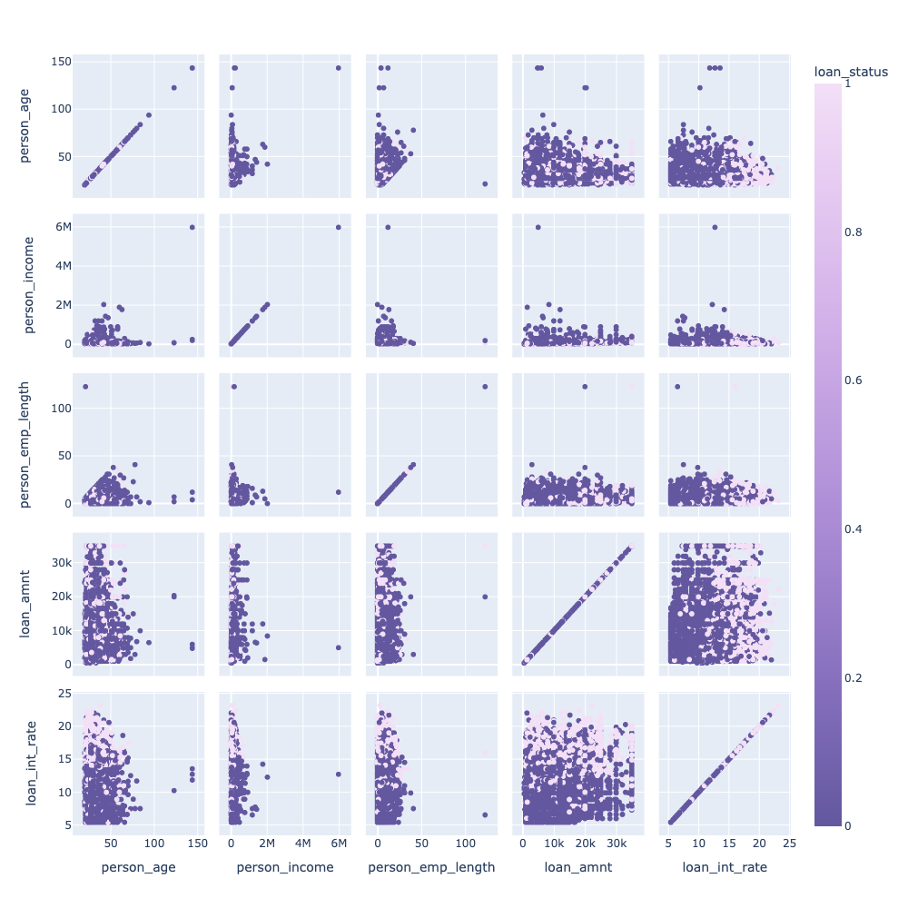
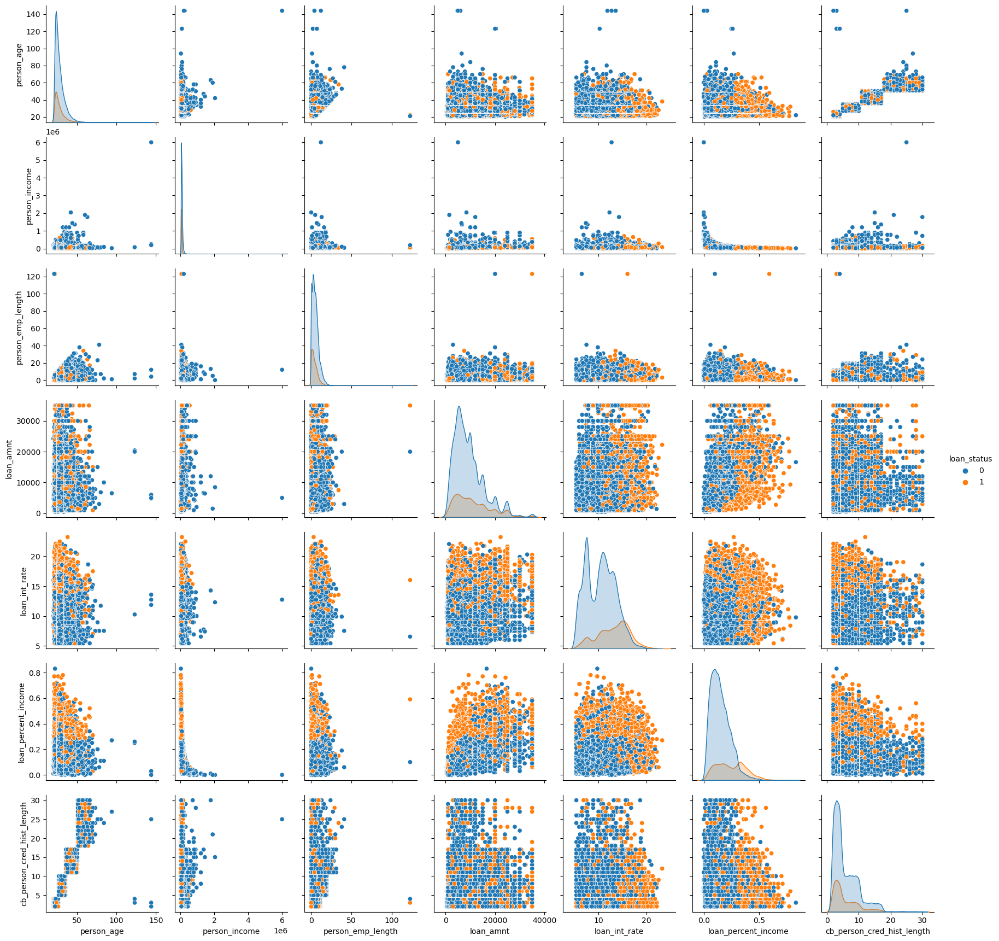
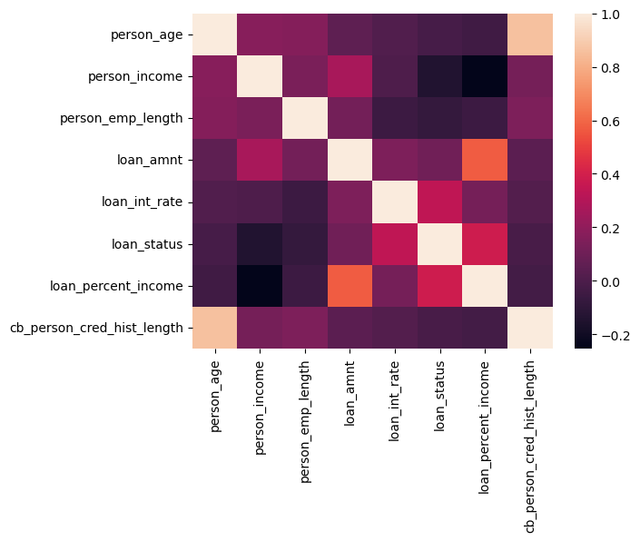
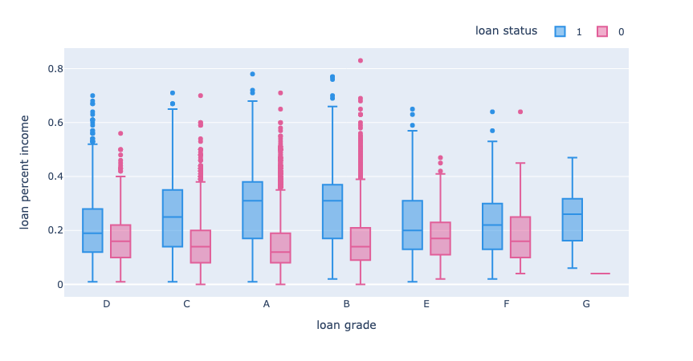
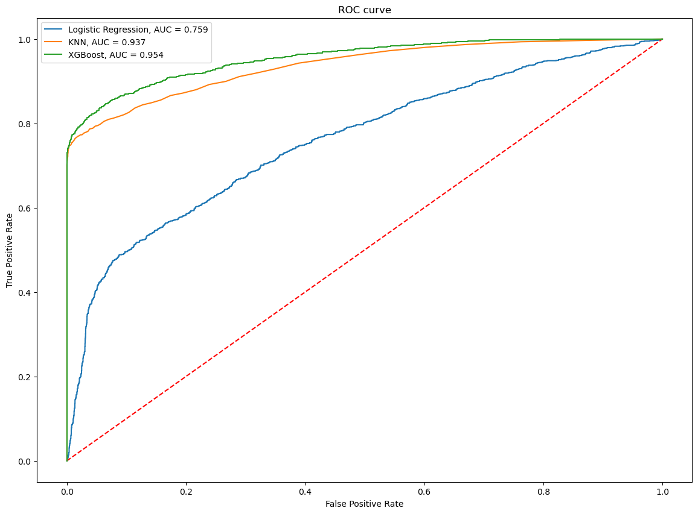
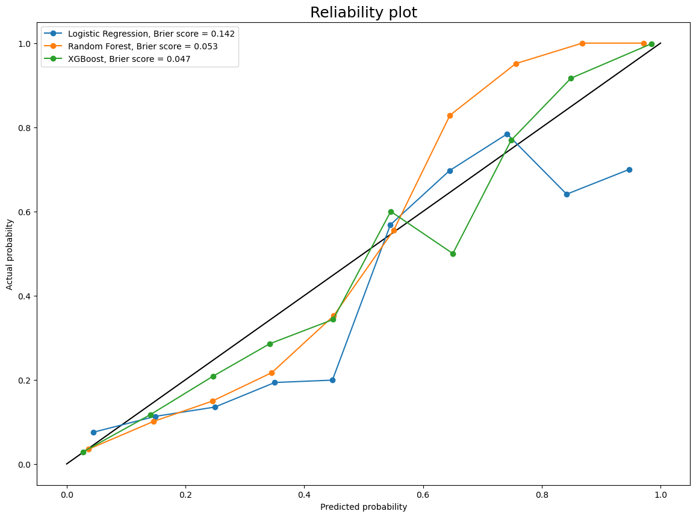

# Credit <span style="color:red">Risk</span> Analysis

This repository contains code and resources for a credit risk analysis project. The project aims to develop a classification model that can predict the creditworthiness of a borrower based on their financial and credit history.

## Data

The data used for this project is sourced from [Kaggle](https://www.kaggle.com/datasets/laotse/credit-risk-dataset). The dataset contains 32,581 samples and 11 features, including information on the borrower's: credit score, income, debt-to-income ratio, and other relevant factors.

## Usage

To use the code in this repository, follow these steps:

1. Clone the repository to your local machine.

```
git clone https://github.com/hritikvalluvar/credit-risk-analysis
```

2. Navigate to the directory.

```
cd credit-risk-analysis
```

3. Create a virtual environment and activate it.

```
python -m venv env

source env/bin/activate
```

4. Install the dependencies

```
pip install -r requirements.txt
```

5. Run streamlit app

```
streamlit run app.py
```

## Exploratory Data Analysis








## Results

The classification model developed for this project achieved an accuracy of 94% on the test set. The model can be used to predict the creditworthiness of new borrowers and inform lending decisions.





## License

This project is licensed under the MIT License - see the [LICENSE](LICENSE) file for details.

## Contact

For questions or inquiries, please contact [here](https://www.linkedin.com/in/hritikvalluvar/).